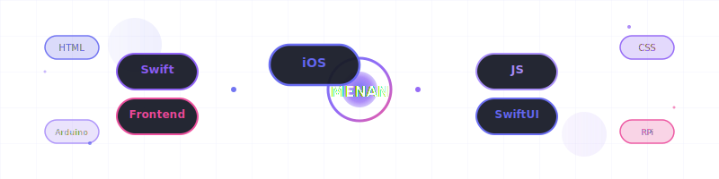

  
  
  
   
  
  
  
  
  
   
  
  
  

---

## 🚀 About Me

Computer Science student at **South East European University** passionate about building beautiful mobile and web experiences. Currently focused on iOS development while maintaining strong frontend skills.

- 📱 **Currently Learning:** iOS Development with Swift & SwiftUI  
- 🎯 **Goal:** Become a professional iOS Developer

---

## 🛠️ Tech Stack

  
  <h3>Languages & Frameworks</h3>
  
  
  
  
  
  
  
  
    
  
  <h3>Databases & Tools</h3>
  
  
  
  
  
  
    
  
  <h3>Hardware</h3>
  
  
  
  

---

## 📊 GitHub Streak

  
  
  
   
  
  
  

---

## 🎯 Current Focus

- 📱 Building iOS apps with **Swift** and **SwiftUI**
- 🎨 Creating responsive frontend interfaces
- 🤖 Exploring IoT projects with Arduino & Raspberry Pi

---

## 🌟 Featured Projects

  
  
   
  <i>A comprehensive flight booking platform built with modern web technologies.</i>
  
    
  
  
   
  <i>Global payroll orchestration platform built with Next.js, TypeScript, and Tailwind CSS.</i>
  

---

## 🤝 Connect With Me

  
  
  &nbsp;
  
  &nbsp;
  
  &nbsp;
  
  

---

  
  
  
   
  
  **`if (works) { don't.touch(); }`**
  
   
  
  
  

