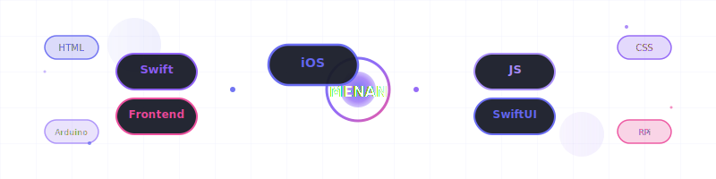

<div align="center">
  
  <!-- Animated Header Wave -->
  
  
  <!-- Enhanced Typing Header -->
  
  
  <!-- Animated Typing Effect -->
  
  
  <!-- Animated Profile Stats -->
  
  
  <!-- Tech Stack Visualization -->
  <div align="center">
    
  </div>
  
</div>

---

## 🚀 About Me

```javascript
const developer = {
  name: "Menan Sali",
  location: "South East European University",
  education: "Computer Science (Bachelors Degree)",
  languages: ["C++", "C#", "CSS", "JavaScript"],
  frameworks: [".NET 8", "Web Development"],
  databases: ["PostgreSQL", "MongoDB", "MySQL"],
  tools: ["Git", "Visual Studio", "GitHub"],
  interests: ["Web Development", "Software Development", "iOS Apps"],
  currentlyLearning: "iOS Development"
};
```

## 🛠️ Tech Stack

<div align="center">
  
  <!-- Languages -->
  
  
  
  
  
  <!-- Frameworks -->
  
  
  
  <!-- Databases -->
  
  
  
  
  <!-- Tools -->
  
  
  
  
  <!-- Learning -->
  
  
  
</div>

## 📊 GitHub Analytics

<div align="center">
  
  <!-- Streak Stats -->
  
  
  <!-- Language Stats -->
  
  
  <!-- Contribution Graph -->
  
  
</div>

## 🎯 Current Focus

<div align="center">
  
  <!-- Animated Progress Bars -->
  
  
</div>

## 🌟 Featured Projects

<div align="center">
  
  <!-- Project Cards with Hover Effects -->
  <table>
    <tr>
      <td align="center">
        <a href="https://github.com/menansali/Flight-booking-website">
          
        </a>
      </td>
      <td align="center">
        <a href="https://github.com/menansali/Basic-BankMenagementSystem">
          
        </a>
      </td>
    </tr>
  </table>
  
</div>

## 🤝 Connect With Me

<div align="center">
  
  <a href="https://menansali.com">
    
  </a>
  <a href="https://github.com/menansali">
    
  </a>
  <a href="mailto:menansali@example.com">
    
  </a>
  
</div>

---

<div align="center">
  
  <!-- Footer Decoration -->
  <div align="center">
    
  </div>
  
  <br>
  
  **"Turning caffeine into code, one commit at a time"** ☕️💻
  
  
  
</div>
