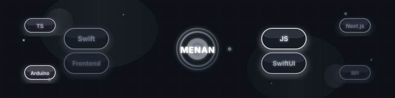

  
  
  
   
  
  
  
  
  
   
  
  
  

---

## 🚀 About Me

Computer Science graduate from **South East European University** — I build and ship products, mostly native iOS apps and the backends behind them.

- 📱 **iOS** — native apps built with Swift & SwiftUI, from first screen to the App Store
- 🧩 **Dev tooling** — MCP servers that drop straight into Claude Code, Cursor, Codex & Zed
- 🌐 **Full-stack** — Next.js + TypeScript + Postgres products, deployed and running in production
- 📡 **RF & IoT** — radio propagation modelling on real terrain, Arduino, Raspberry Pi, LoRa sensor networks

*Currently: shipping iOS apps to the App Store and open-sourcing the tools I needed along the way.*

---

## 🛠️ Tech Stack

  
  <h3>Languages</h3>
  
  
  
  
  
  
  
  
    
  
  <h3>Frameworks</h3>
  
  
  
  
  
  
  
  
    
  
  <h3>Databases & Tools</h3>
  
  
  
  
  
  
  
  
    
  
  <h3>Hardware</h3>
  
  
  
  

---

## 📊 Activity

  
  
  
   
  
  
  

---

## 🌟 Featured Projects

  
  
  &nbsp;
  
  &nbsp;
  
  

 

**Open source**

| Project | What it is | Stack |
| :--- | :--- | :--- |
| **[iOS Ship Doctor](https://github.com/menansali/ios-ship-doctor)** | An MCP server that catches App Store rejections *before* you hit Submit — privacy manifests, missing permission strings, unlisted SDKs — then fixes them | TypeScript · MCP · Node |
| **[npm-gamify](https://github.com/menansali/npm-gamify)** | Earn XP, level up and unlock achievements every time you run npm, pnpm, yarn or bun | TypeScript · CLI |
| **[Personal Portfolio](https://github.com/menansali/Personal-Portfolio)** · [live](https://menan.titanix.dev) | iOS-themed portfolio — the whole site behaves like an iPhone home screen | Next.js · TypeScript |

**Also building**

| Project | What it is | Stack |
| :--- | :--- | :--- |
| **[Titanix](https://titanix.dev)** | Agency site with an interactive "Smart Consultant" that scopes project ideas into timelines and stacks | Next.js · TypeScript |
| **PetPortraits** | One photo of your pet becomes a gallery-grade AI portrait in ~20 seconds | SwiftUI · iOS |
| **LaunchMast** | AI operating system for mobile app launches — generates the app, then preps screenshots, ASO, localization and compliance for the stores | Next.js · Anthropic SDK |
| **skeniraj.mk** | QR menu platform for restaurants, bars, cafés and hotels | Turborepo · tRPC · Drizzle |

---

## 🤝 Connect With Me

  
  
  &nbsp;
  
  &nbsp;
  
  &nbsp;
  
  

---

  
  
  
   
  
  **`if (works) { don't.touch(); }`**
  
   
  
  
  

